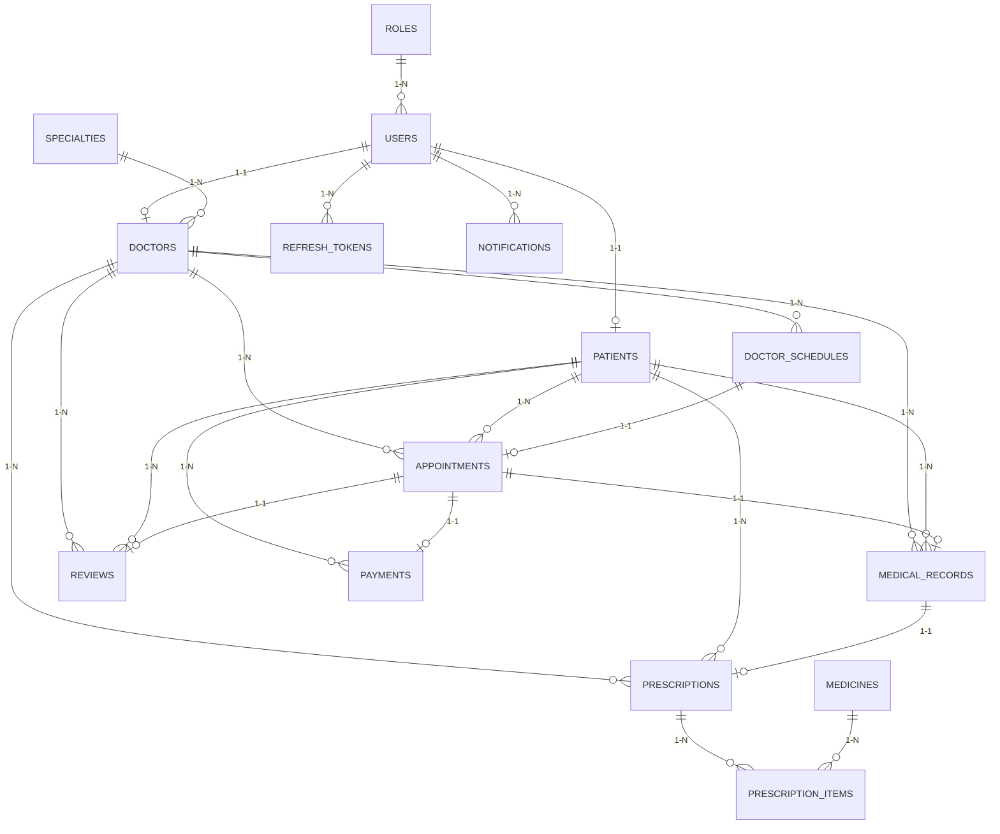

# 🗄️ Database Schema — Booking Clinic System

> **Mục đích:** Mô tả cấu trúc toàn bộ các bảng trong database, kiểu dữ liệu, và mối quan hệ.  
> **Cập nhật lần cuối:** 2026-05-07  
> **ORM:** Spring Data JPA / Hibernate  
> **Database:** MySQL

---

## 1. Tổng quan mối quan hệ (Entity Relationship)



---

## 2. Quan hệ đặc biệt: User ↔ Doctor ↔ Patient

> ⚠️ **Đây là mối quan hệ QUAN TRỌNG NHẤT cần hiểu đúng.**

```
┌─────────┐    1:1     ┌──────────┐
│  users  │◄──────────►│ doctors  │   (doctors.user_id → users.id, UNIQUE)
│         │            └──────────┘
│         │    1:1     ┌──────────┐
│         │◄──────────►│ patients │   (patients.user_id → users.id, UNIQUE)
└─────────┘            └──────────┘
```

- **`User`** là bảng chứa thông tin xác thực chung (email, password, role, status).
- **`Doctor`** là bảng mở rộng chứa thông tin chuyên môn bác sĩ. Liên kết **1-1** với `User` qua `user_id`.
- **`Patient`** là bảng mở rộng chứa thông tin y tế bệnh nhân. Liên kết **1-1** với `User` qua `user_id`.
- **`User.id` ≠ `Doctor.id`** và **`User.id` ≠ `Patient.id`**. Đây là các bảng riêng biệt với auto-increment ID riêng.
- Khi cần so sánh quyền sở hữu, PHẢI đi qua `doctor.getUser().getId()` hoặc `patient.getUser().getId()`.

---

## 3. Chi tiết các bảng

### 3.1. `roles`

| Cột | Kiểu dữ liệu | Ràng buộc | Mô tả |
|---|---|---|---|
| `id` | BIGINT | PK (không auto-gen) | ID thủ công |
| `name` | VARCHAR(30) | NOT NULL, UNIQUE | Tên role: ADMIN, DOCTOR, PATIENT |
| `created_at` | DATETIME | NOT NULL | Thời gian tạo |
| `updated_at` | DATETIME | NOT NULL | Thời gian cập nhật |

---

### 3.2. `users`

| Cột | Kiểu dữ liệu | Ràng buộc | Mô tả |
|---|---|---|---|
| `id` | BIGINT | PK, AUTO_INCREMENT | — |
| `role_id` | BIGINT | FK → roles.id, NOT NULL | Role của user |
| `full_name` | VARCHAR(100) | NOT NULL | Họ tên |
| `email` | VARCHAR(100) | NOT NULL, UNIQUE | Email (dùng để login) |
| `phone` | VARCHAR(20) | NOT NULL | Số điện thoại |
| `password` | VARCHAR(255) | NOT NULL | Mật khẩu (BCrypt encoded) |
| `avatar_url` | VARCHAR(255) | NOT NULL | URL ảnh đại diện |
| `status` | VARCHAR(20) | NOT NULL | Trạng thái: ACTIVE, INACTIVE, BANNED |
| `auth_provider` | VARCHAR(20) | DEFAULT 'LOCAL' | Nguồn xác thực: LOCAL, GOOGLE, FACEBOOK |
| `google_id` | VARCHAR(100) | NULLABLE | Google unique ID (nếu có) |
| `reset_password_otp` | VARCHAR(6) | NULLABLE | OTP reset password |
| `otp_expiration_time` | DATETIME | NULLABLE | Hạn OTP |
| `last_otp_request_time` | DATETIME | NULLABLE | Thời gian gửi OTP gần nhất (rate limit) |
| `otp_failed_attempts` | INT | DEFAULT 0 | Số lần nhập OTP sai |
| `created_at` | DATETIME | — | Thời gian tạo |
| `updated_at` | DATETIME | NOT NULL | Thời gian cập nhật |

**Quan hệ:** `users.role_id` → `roles.id` (Many-to-One)

---

### 3.3. `doctors`

| Cột | Kiểu dữ liệu | Ràng buộc | Mô tả |
|---|---|---|---|
| `id` | BIGINT | PK, AUTO_INCREMENT | — |
| `user_id` | BIGINT | FK → users.id, NOT NULL, UNIQUE | **1-1** với User |
| `specialty_id` | BIGINT | FK → specialties.id, NULLABLE | Chuyên khoa |
| `experience_years` | INT | NULLABLE | Số năm kinh nghiệm |
| `qualification` | VARCHAR(255) | NULLABLE | Bằng cấp |
| `biography` | TEXT | NULLABLE | Tiểu sử |
| `clinic_room` | VARCHAR(50) | NULLABLE | Phòng khám |
| `average_rating` | DECIMAL(3,2) | NULLABLE | Đánh giá trung bình |
| `consultation_fee` | DECIMAL(12,2) | NOT NULL | Phí khám |
| `status` | VARCHAR(20) | NULLABLE | Trạng thái |
| `created_at` | DATETIME | — | Thời gian tạo |
| `updated_at` | DATETIME | — | Thời gian cập nhật |

**Quan hệ:**
- `doctors.user_id` → `users.id` (**One-to-One**, UNIQUE)
- `doctors.specialty_id` → `specialties.id` (Many-to-One)

---

### 3.4. `patients`

| Cột | Kiểu dữ liệu | Ràng buộc | Mô tả |
|---|---|---|---|
| `id` | BIGINT | PK, AUTO_INCREMENT | — |
| `user_id` | BIGINT | FK → users.id, NOT NULL, UNIQUE | **1-1** với User |
| `date_of_birth` | DATE | NULLABLE | Ngày sinh |
| `gender` | VARCHAR(10) | NULLABLE | Giới tính |
| `address` | VARCHAR(255) | NULLABLE | Địa chỉ |
| `blood_type` | VARCHAR(10) | NULLABLE | Nhóm máu |
| `identity_number` | VARCHAR(30) | NULLABLE | CMND/CCCD |
| `insurance_number` | VARCHAR(50) | NULLABLE | Số BHYT |
| `emergency_contact_phone` | VARCHAR(20) | NULLABLE | SĐT khẩn cấp |
| `medical_history_note` | TEXT | NULLABLE | Ghi chú tiền sử bệnh |

**Quan hệ:** `patients.user_id` → `users.id` (**One-to-One**, UNIQUE)

> ⚠️ Bảng `patients` không có `created_at`/`updated_at`.

---

### 3.5. `specialties`

| Cột | Kiểu dữ liệu | Ràng buộc | Mô tả |
|---|---|---|---|
| `id` | BIGINT | PK, AUTO_INCREMENT | — |
| `name` | VARCHAR(100) | NOT NULL, UNIQUE | Tên chuyên khoa |
| `description` | TEXT | NULLABLE | Mô tả |
| `created_at` | DATETIME | — | Thời gian tạo |
| `updated_at` | DATETIME | NOT NULL | Thời gian cập nhật |

---

### 3.6. `doctor_schedules`

| Cột | Kiểu dữ liệu | Ràng buộc | Mô tả |
|---|---|---|---|
| `id` | BIGINT | PK, AUTO_INCREMENT | — |
| `doctor_id` | BIGINT | FK → doctors.id, NOT NULL | Bác sĩ |
| `work_date` | DATE | NOT NULL | Ngày làm việc |
| `start_time` | TIME | NOT NULL | Giờ bắt đầu |
| `end_time` | TIME | NOT NULL | Giờ kết thúc |
| `status` | VARCHAR(20) | NOT NULL | AVAILABLE, BOOKED, CANCELLED |
| `created_at` | DATETIME | — | Thời gian tạo |
| `updated_at` | DATETIME | — | Thời gian cập nhật |

**Quan hệ:** `doctor_schedules.doctor_id` → `doctors.id` (Many-to-One)

---

### 3.7. `appointments`

| Cột | Kiểu dữ liệu | Ràng buộc | Mô tả |
|---|---|---|---|
| `id` | BIGINT | PK, AUTO_INCREMENT | — |
| `patient_id` | BIGINT | FK → patients.id, NOT NULL | Bệnh nhân |
| `doctor_id` | BIGINT | FK → doctors.id, NOT NULL | Bác sĩ |
| `schedule_id` | BIGINT | FK → doctor_schedules.id, NULLABLE | Khung giờ |
| `appointment_date` | DATE | NOT NULL | Ngày hẹn |
| `reason` | TEXT | NULLABLE | Lý do khám |
| `status` | VARCHAR(20) | NOT NULL, ENUM | Trạng thái (xem bảng Enum bên dưới) |
| `cancel_reason` | MEDIUMTEXT | NULLABLE | Lý do hủy |
| `created_at` | DATETIME | — | Thời gian tạo |
| `updated_at` | DATETIME | — | Thời gian cập nhật |

**Enum `AppointmentStatus`:** `PENDING`, `CONFIRMED`, `REQUESTED`, `SCHEDULED`, `IN_PROGRESS`, `COMPLETED`, `CANCELLED`

**Quan hệ:**
- `appointments.patient_id` → `patients.id` (Many-to-One)
- `appointments.doctor_id` → `doctors.id` (Many-to-One)
- `appointments.schedule_id` → `doctor_schedules.id` (Many-to-One)

---

### 3.8. `medical_records`

| Cột | Kiểu dữ liệu | Ràng buộc | Mô tả |
|---|---|---|---|
| `id` | BIGINT | PK, AUTO_INCREMENT | — |
| `appointment_id` | BIGINT | FK → appointments.id, NOT NULL, UNIQUE | **1-1** với Appointment |
| `doctor_id` | BIGINT | FK → doctors.id, NOT NULL | Bác sĩ khám |
| `patient_id` | BIGINT | FK → patients.id, NOT NULL | Bệnh nhân |
| `symptoms` | TEXT | NOT NULL | Triệu chứng |
| `diagnosis` | TEXT | NOT NULL | Chẩn đoán |
| `treatment_plan` | TEXT | NOT NULL | Phương pháp điều trị |
| `notes` | TEXT | NULLABLE | Ghi chú thêm |
| `follow_up_date` | DATE | NULLABLE | Ngày tái khám |
| `created_at` | DATETIME | — | Thời gian tạo |
| `updated_at` | DATETIME | — | Thời gian cập nhật |

**Quan hệ:**
- `medical_records.appointment_id` → `appointments.id` (**One-to-One**, UNIQUE)
- `medical_records.doctor_id` → `doctors.id` (Many-to-One)
- `medical_records.patient_id` → `patients.id` (Many-to-One)

---

### 3.9. `prescriptions`

| Cột | Kiểu dữ liệu | Ràng buộc | Mô tả |
|---|---|---|---|
| `id` | BIGINT | PK, AUTO_INCREMENT | — |
| `medical_record_id` | BIGINT | FK → medical_records.id, UNIQUE | **1-1** với MedicalRecord |
| `doctor_id` | BIGINT | FK → doctors.id, NULLABLE | Bác sĩ kê đơn |
| `patient_id` | BIGINT | FK → patients.id, NULLABLE | Bệnh nhân |
| `general_note` | TEXT | NULLABLE | Ghi chú chung |
| `status` | VARCHAR(255) | NULLABLE | ACTIVE, CANCELLED |
| `total_price` | DECIMAL(12,2) | NULLABLE | Tổng tiền thuốc (auto-calculated) |
| `created_at` | DATETIME | — | Thời gian tạo |
| `updated_at` | DATETIME | — | Thời gian cập nhật |

**Quan hệ:**
- `prescriptions.medical_record_id` → `medical_records.id` (**One-to-One**, UNIQUE)
- `prescriptions.doctor_id` → `doctors.id` (Many-to-One)
- `prescriptions.patient_id` → `patients.id` (Many-to-One)

> ⚠️ `total_price` được tự động tính bằng `@PrePersist`/`@PreUpdate` = tổng `lineTotal` của tất cả `PrescriptionItem`.

---

### 3.10. `medicines`

| Cột | Kiểu dữ liệu | Ràng buộc | Mô tả |
|---|---|---|---|
| `id` | BIGINT | PK, AUTO_INCREMENT | — |
| `name` | VARCHAR(255) | — | Tên thuốc |
| `unit_price` | DECIMAL(12,2) | NULLABLE | Đơn giá |
| `unit` | VARCHAR(30) | NULLABLE | Đơn vị: viên, hộp, chai, ống |
| `status` | VARCHAR(255) | ENUM | ACTIVE, INACTIVE |

**Enum `MedicineStatus`:** `ACTIVE`, `INACTIVE`

---

### 3.11. `prescription_items`

| Cột | Kiểu dữ liệu | Ràng buộc | Mô tả |
|---|---|---|---|
| `id` | BIGINT | PK, AUTO_INCREMENT | — |
| `prescription_id` | BIGINT | FK → prescriptions.id | Đơn thuốc cha |
| `medicine_id` | BIGINT | FK → medicines.id | Thuốc |
| `dose_per_time` | INT | NULLABLE | Liều mỗi lần |
| `times_per_day` | INT | NULLABLE | Số lần/ngày |
| `duration_days` | INT | NULLABLE | Số ngày uống |
| `quantity` | INT | NULLABLE | **Auto-calculated:** dosePerTime × timesPerDay × durationDays |
| `unit_price` | DECIMAL(12,2) | NULLABLE | **Snapshot** giá thuốc tại thời điểm kê đơn |
| `line_total` | DECIMAL(12,2) | NULLABLE | **Auto-calculated:** unitPrice × quantity |
| `dosage_text` | VARCHAR(255) | NULLABLE | Mô tả liều dùng |
| `instruction` | TEXT | NULLABLE | Hướng dẫn sử dụng |
| `note` | TEXT | NULLABLE | Ghi chú |

**Quan hệ:**
- `prescription_items.prescription_id` → `prescriptions.id` (Many-to-One, cascade ALL, orphanRemoval)
- `prescription_items.medicine_id` → `medicines.id` (Many-to-One)

> ⚠️ `unit_price` là **price snapshot** — lưu giá thuốc tại thời điểm kê đơn, KHÔNG phải giá hiện tại từ bảng `medicines`. Điều này đảm bảo tính toàn vẹn tài chính.

---

### 3.12. `payments`

| Cột | Kiểu dữ liệu | Ràng buộc | Mô tả |
|---|---|---|---|
| `id` | BIGINT | PK, AUTO_INCREMENT | — |
| `appointment_id` | BIGINT | FK → appointments.id, UNIQUE | **1-1** với Appointment |
| `patient_id` | BIGINT | FK → patients.id | Bệnh nhân |
| `amount` | DECIMAL(12,2) | NULLABLE | Tổng tiền = consultation_fee + total_medicine_price |
| `payment_method` | VARCHAR(30) | NULLABLE | Phương thức: CASH, CARD, TRANSFER... |
| `status` | VARCHAR(20) | NULLABLE | PENDING, PAID, FAILED, CANCELLED |
| `created_at` | DATETIME | — | Thời gian tạo |
| `updated_at` | DATETIME | — | Thời gian cập nhật |

**Quan hệ:**
- `payments.appointment_id` → `appointments.id` (**One-to-One**, UNIQUE)
- `payments.patient_id` → `patients.id` (Many-to-One)

---

### 3.13. `reviews`

| Cột | Kiểu dữ liệu | Ràng buộc | Mô tả |
|---|---|---|---|
| `id` | BIGINT | PK, AUTO_INCREMENT | — |
| `appointment_id` | BIGINT | FK → appointments.id, NOT NULL, UNIQUE | **1-1** với Appointment |
| `doctor_id` | BIGINT | FK → doctors.id, NOT NULL | Bác sĩ được đánh giá |
| `patient_id` | BIGINT | FK → patients.id, NOT NULL | Bệnh nhân đánh giá |
| `rating` | INT | NOT NULL | Số sao (1-5) |
| `comment` | TEXT | NULLABLE | Bình luận |
| `created_at` | DATETIME | — | Thời gian tạo |
| `updated_at` | DATETIME | — | Thời gian cập nhật |

**Quan hệ:**
- `reviews.appointment_id` → `appointments.id` (**One-to-One**, UNIQUE)
- `reviews.doctor_id` → `doctors.id` (Many-to-One)
- `reviews.patient_id` → `patients.id` (Many-to-One)

---

### 3.14. `notifications`

| Cột | Kiểu dữ liệu | Ràng buộc | Mô tả |
|---|---|---|---|
| `id` | BIGINT | PK, AUTO_INCREMENT | — |
| `user_id` | BIGINT | FK → users.id, NOT NULL | Người nhận |
| `title` | VARCHAR(150) | NOT NULL | Tiêu đề |
| `message` | TEXT | NOT NULL | Nội dung |
| `type` | VARCHAR(50) | NULLABLE | Loại thông báo |
| `reference_type` | VARCHAR(50) | NULLABLE | Loại entity liên quan |
| `reference_id` | BIGINT | NULLABLE | ID entity liên quan |
| `is_read` | BOOLEAN | NOT NULL, DEFAULT false | Đã đọc chưa |
| `created_at` | DATETIME | — | Thời gian tạo |
| `updated_at` | DATETIME | — | Thời gian cập nhật |

**Quan hệ:** `notifications.user_id` → `users.id` (Many-to-One)

---

### 3.15. `refresh_tokens`

| Cột | Kiểu dữ liệu | Ràng buộc | Mô tả |
|---|---|---|---|
| `id` | BIGINT | PK, AUTO_INCREMENT | — |
| `user_id` | BIGINT | FK → users.id, NOT NULL | Chủ token |
| `refresh_token` | VARCHAR(500) | NOT NULL, UNIQUE | Giá trị token |
| `expired_at` | DATETIME | NOT NULL | Hạn token |
| `revoked` | BOOLEAN | NOT NULL | Đã thu hồi chưa |
| `created_at` | DATETIME | — | Thời gian tạo |
| `updated_at` | DATETIME | — | Thời gian cập nhật |

**Quan hệ:** `refresh_tokens.user_id` → `users.id` (Many-to-One)

---

## 4. Tóm tắt các mối quan hệ

| Quan hệ | Loại | Ghi chú |
|---|---|---|
| `User` ↔ `Role` | Many-to-One | Mỗi User có 1 Role |
| `User` ↔ `Doctor` | **One-to-One** | `user_id` UNIQUE trong doctors |
| `User` ↔ `Patient` | **One-to-One** | `user_id` UNIQUE trong patients |
| `User` ↔ `RefreshToken` | One-to-Many | Mỗi User có nhiều refresh token |
| `User` ↔ `Notification` | One-to-Many | Mỗi User nhận nhiều thông báo |
| `Doctor` ↔ `Specialty` | Many-to-One | Mỗi Doctor thuộc 1 Specialty |
| `Doctor` ↔ `DoctorSchedule` | One-to-Many | Mỗi Doctor có nhiều khung giờ |
| `DoctorSchedule` ↔ `Appointment` | **One-to-One** (logical) | Mỗi khung giờ tối đa 1 appointment |
| `Patient` ↔ `Appointment` | One-to-Many | Mỗi Patient có nhiều lịch hẹn |
| `Doctor` ↔ `Appointment` | One-to-Many | Mỗi Doctor có nhiều lịch hẹn |
| `Appointment` ↔ `MedicalRecord` | **One-to-One** | `appointment_id` UNIQUE |
| `Appointment` ↔ `Payment` | **One-to-One** | `appointment_id` UNIQUE |
| `Appointment` ↔ `Review` | **One-to-One** | `appointment_id` UNIQUE |
| `MedicalRecord` ↔ `Prescription` | **One-to-One** | `medical_record_id` UNIQUE |
| `Prescription` ↔ `PrescriptionItem` | One-to-Many | cascade ALL, orphanRemoval |
| `Medicine` ↔ `PrescriptionItem` | One-to-Many | Mỗi thuốc xuất hiện nhiều đơn |
